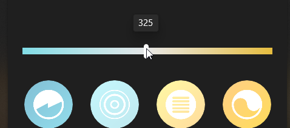

# Welcome to Remix + Vite!

📖 See the [Remix docs](https://remix.run/docs) and the [Remix Vite docs](https://remix.run/docs/en/main/future/vite) for details on supported features.

## Development

Run the Vite dev server:

```shellscript
npm run dev
```

## Deployment

First, build your app for production:

```sh
npm run build
```

Then run the app in production mode:

```sh
npm start
```

Now you'll need to pick a host to deploy it to.

### DIY

If you're familiar with deploying Node applications, the built-in Remix app server is production-ready.

Make sure to deploy the output of `npm run build`

- `build/server`
- `build/client`

## TODOs
Colour temperature selection

#82dce6 -> #e6bd3f translates to colour temps between 222 and 454 (you can get this from `color_temperature.mirek_schema.mirek_(minimum|maximum)`)

Use this site to generate the gradient https://cssgradient.io/

